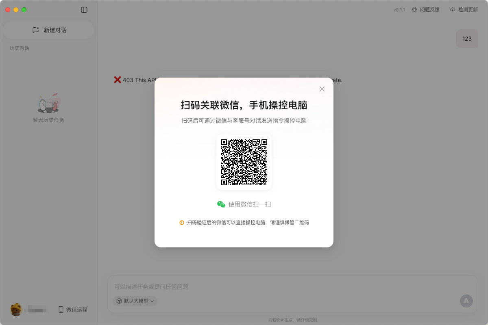
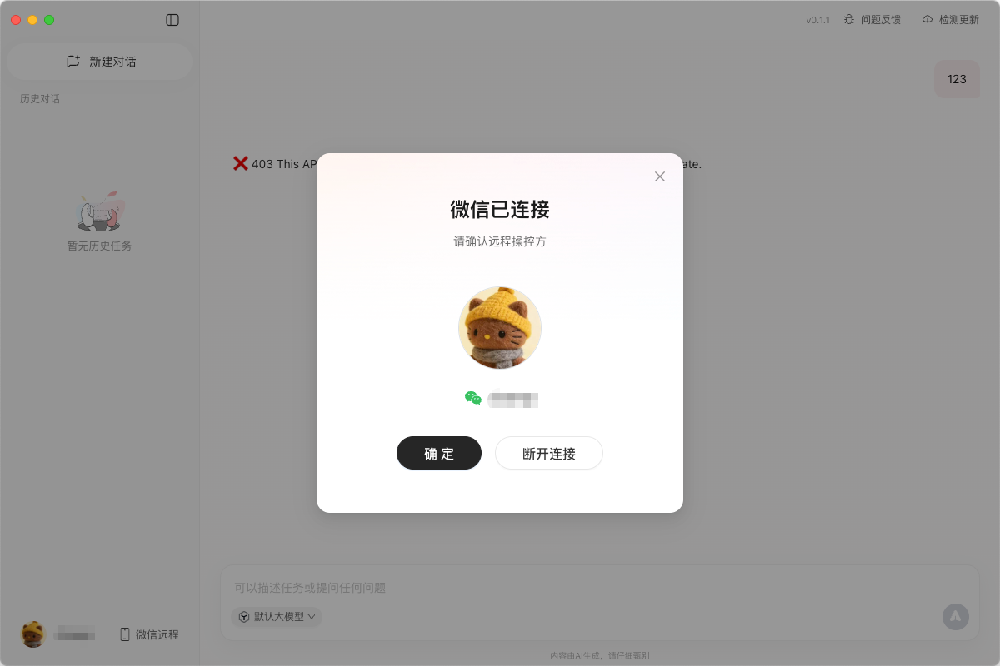
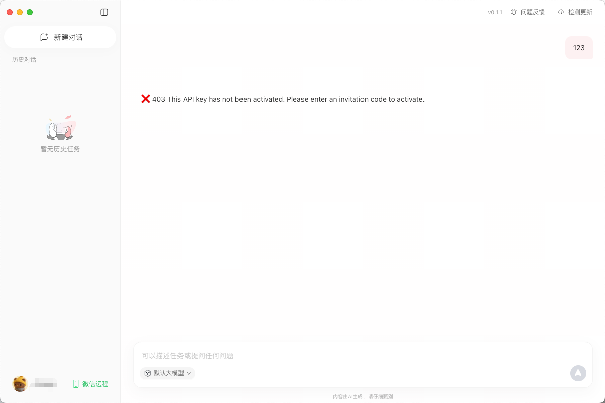

# QClaw 客户端逆向

> 注意：纯客户端逆向，接口仍有限制  
> 当前版本 v0.1.2

## 本地运行

```shell
# 安装依赖
yarn

# 启动客户端
yarn dev v0.1.2
```

## 截图展示






## 微信远程工作原理

### 整体架构

```
微信用户 → 腾讯后端(mmgrcalltoken.3g.qq.com) → OpenClaw Gateway(本地:28789) → AI Agent
                    ↑                                        ↓
                    └──────────── 响应流式回传 ←──────────────┘
```

### 核心组件

| 组件 | 作用 |
|------|------|
| **wechat-access 插件** | WebSocket 客户端，连接腾讯后端 |
| **OpenClaw Gateway** | 本地 AI Agent 网关 (端口 28789) |
| **AGP 协议** | Agent Gateway Protocol，双向消息格式 |
| **content-security 插件** | 内容安全审核拦截器 |

---

### 连接流程

**1. 用户扫码登录** (`WXLoginView-Dzks_Y2M.js`)
- 渲染进程展示微信二维码（使用微信登录 SDK）
- 用户扫码后获取 `auth code`
- 调用 `wxLogin({guid, code, state})` API 登录
- 返回 `channel_token`（用于 WebSocket 认证）和 `jwt_token`（用户会话）

**2. 配置写入**
```js
// 登录成功后写入 OpenClaw 配置
window.electronAPI.config.updateField({
  channels: { "wechat-access": { token: channelToken } },
  plugins: { entries: { "content-security": { config: { token: channelToken } } } },
  models: { providers: { qclaw: { apiKey: apiKey } } }
})
```

**3. WebSocket 连接建立**
- 插件读取配置中的 token 和 wsUrl
- 连接 `wss://mmgrcalltoken.3g.qq.com/agentwss?token={channelToken}`
- 自动重连：指数退避（3s → 4.5s → ... → max 25s）
- 心跳：每 20 秒 ping/pong
- 休眠检测：系统唤醒后自动重连

---

### AGP 消息协议

所有消息使用统一信封格式：

```typescript
{
  msg_id: string,      // UUID，用于去重
  guid: string,        // 设备标识
  user_id: string,     // 微信用户 ID
  method: string,      // 消息类型
  payload: object      // 具体数据
}
```

**消息流向：**

| 方向 | method | 说明 |
|------|--------|------|
| 服务端 → 客户端 | `session.prompt` | 用户发来的指令 |
| 服务端 → 客户端 | `session.cancel` | 取消正在执行的任务 |
| 客户端 → 服务端 | `session.update` | 流式中间结果（文本/工具调用） |
| 客户端 → 服务端 | `session.promptResponse` | 最终响应 |

---

### 消息处理流程

```
1. 收到 session.prompt
   ├─ 消息去重（msg_id Set，上限 1000）
   ├─ 注册 ActiveTurn（支持取消）
   ├─ 构建消息上下文：
   │   sessionKey = "agent:{agentId}:wechat-access:direct:{userId}"
   ├─ 派发给 AI Agent 处理
   │
   ├─ Agent 生成文本 → session.update(message_chunk) → 流式推送
   ├─ Agent 调用工具 → session.update(tool_call) → 推送工具状态
   │
   └─ 完成 → session.promptResponse(stop_reason="end_turn")
```

---

### 设备配对（GUID）

- **GUID** = 设备唯一标识符，通过 `getGuid()` API 获取
- 存储在 `localStorage` 的 `openclaw_connection_guid` 中
- 嵌入在所有 WebSocket 消息中标识来源设备
- `queryDeviceByGuid({guid})` 校验设备是否仍在线
- `disconnectDevice({guid})` 断开设备连接

---

### 远程控制状态管理

```js
localStorage keys:
  "openclaw_remote_control_enabled"  // 是否启用远程控制
  "openclaw_connected_user"          // 已连接的微信用户信息 {nickname, avatar}
  "openclaw_connection_guid"         // 设备 GUID
```

---

### 相关 API（data/4xxx/forward 模式）

| API 路径 | 方法 | 用途 |
|---------|------|------|
| `data/4055/forward` | `createApiKey` | 创建模型 API Key |
| `data/4056/forward` | `checkInviteCode` | 检查邀请码验证状态 |
| `data/4057/forward` | `submitInviteCode` | 提交邀请码 |
| `data/4064/forward` | content-security | 内容安全审核 |

---

### 关键源文件

| 文件 | 说明 |
|------|------|
| `resources/0.1.1/openclaw/config/extensions/wechat-access/index.ts` | 插件注册入口 |
| `.../wechat-access/websocket/websocket-client.ts` (740行) | WebSocket 客户端核心 |
| `.../wechat-access/websocket/message-handler.ts` (613行) | AGP 消息处理、Agent 事件流 |
| `.../wechat-access/websocket/types.ts` (291行) | AGP 协议类型定义 |
| `.../wechat-access/common/message-context.ts` | 消息上下文构建与路由 |
| `.../wechat-access/websocket.md` | AGP 协议规范文档 |
| `src/v0.1.1/out/renderer/assets/WXLoginView-Dzks_Y2M.js` | 微信扫码登录 UI |
| `src/v0.1.1/out/renderer/assets/Chat-B6WG69P8.js` | 聊天主组件，远程连接管理 |
| `src/v0.1.1/out/renderer/assets/platform-QEsQ5tXh.js` | API 服务类定义 |
